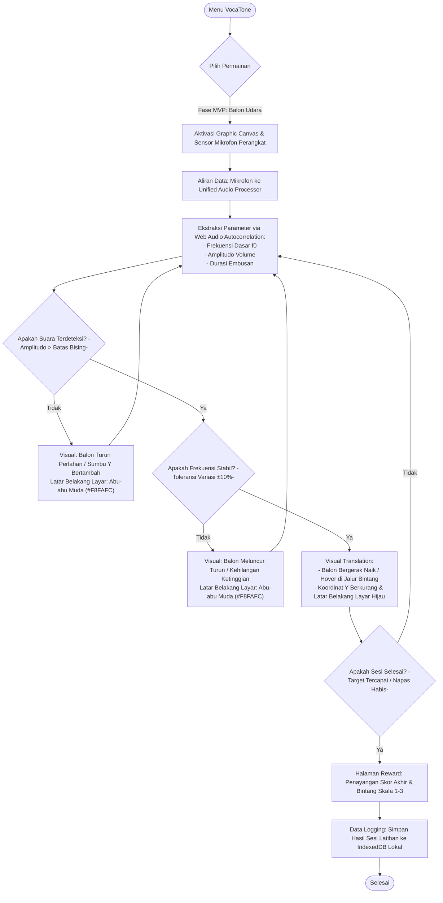

# Dokumen Desain Game (GDD): VocaTone - Balon Udara

Modul 1: VocaTone dirancang sebagai fase fondasi fonasi dalam ekosistem V-NADA. Fokus utama modul ini adalah melatih kontrol pita suara (frekuensi dasar f0), kekuatan embusan napas, dan durasi keluaran suara tanpa melibatkan deteksi visual wajah. Mekanik utama menggunakan representasi visual "Balon Udara" untuk memberikan umpan balik sensorik (Substitusi Sensorik) bagi siswa tunarungu.

**Kode Dokumen:** GAME-01
**Versi:** 2

---

## 1. Core Game Loop (Siklus Utama Permainan)

---

## 2. Mekanika Pergerakan Objek (Y-Axis Mapping)

Sistem menggunakan pemetaan linear dan logis untuk mengubah input audio menjadi pergerakan vertikal pada layar (Sumbu-Y).

| Kondisi Permainan | Parameter Audio Input | Aksi Visual Objek |
|---|---|---|
| **Naik (Rising)** | Amplitudo > Ambient Noise Threshold DAN durasi embusan aktif. | Balon bergerak ke atas secara konstan (Y berkurang). |
| **Stabil (Hovering)** | f0 berada dalam rentang target [f_min, f_max]. | Balon bertahan di jalur tengah (jalur awan/bintang). |
| **Turun (Falling)** | Amplitudo < Threshold (Diam) ATAU pasokan udara habis. | Balon turun perlahan akibat gravitasi simulasi (Y bertambah). |

**Formula Logika Dasar:**

- `Y_pos = Y_initial - (K_speed × Duration)` jika validasi audio benar.
- Keberhasilan sesi dihitung berdasarkan akumulasi waktu (t) di mana `f0 ≈ f_target`.

---

## 3. Kalibrasi Golden Age (Target Usia 7-9 Tahun)

Untuk mencegah frustrasi pada siswa fase A & B (7-9 tahun), parameter sensitivitas diatur dengan ambang batas yang ramah anak:

- **Ambang Batas Stabilitas:** Toleransi variasi f0 sebesar ±10% dari nada referensi untuk tetap dianggap "Stabil".
- **Target Durasi (Khusus Modul 1 — VocaTone):**
  - Skor Minimal: Berhasil mengeluarkan suara selama 1 detik.
  - Skor Penuh (3 Bintang): Mampu mempertahankan suara konstan selama 3-5 detik.
  - **Catatan:** Sistem penilaian berbasis persentase akurasi LAR untuk Modul 2 (Dual-Sense) didefinisikan terpisah di GAME-04.
- **Umpan Balik Visual Kontras (Binary Feedback):**
  - Latar Belakang Layar berwarna Hijau (#22C55E) saat fonasi benar.
  - Latar Belakang Layar berwarna Abu-abu Muda (#F8FAFC) saat suara terputus-putus.

---

## 4. Spesifikasi Teknis MVP (Single-Game Mode)

Sesuai dengan dokumen MVP, pengembangan awal dibatasi pada:

- **Infrastructure:** 100% Client-side processing menggunakan Web Audio API.
- **Mode:** Offline-first melalui teknologi PWA.
- **Audio Algorithm:** Menggunakan Autocorrelation Pitch Detection untuk efisiensi memori gawai menengah ke bawah.

---

## 5. Panduan Implementasi untuk Tim

1. **Game Artist:** Buat aset Balon Udara yang ekspresif (misal: balon sedikit membesar saat naik). Sertakan aset latar belakang berupa "Jalur Bintang" di ketinggian tertentu sebagai pemandu visual bagi anak.
2. **Lead Developer:** Implementasikan Noise Floor Gate. Pastikan ambang batas RMS dikalibrasi di awal sesi untuk menghindari input suara lingkungan (ambient noise) yang memicu pergerakan balon. Modul VocaTone murni berbasis audio dan tidak membutuhkan pipeline validasi visual (Sequential Validation) — pipeline tersebut khusus untuk Modul 2 Dual-Sense.