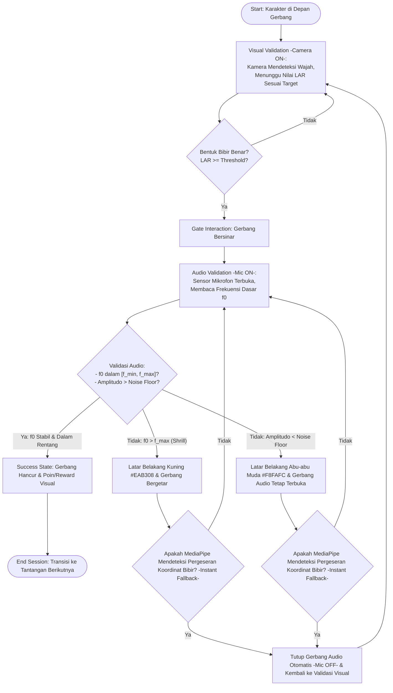

# Dokumen Desain Game (GDD): Dual-Sense - Penghancur Gerbang

Modul 2: Dual-Sense dirancang sebagai fase kedua fonasi dalam ekosistem V-NADA. Fokus utama modul ini adalah melatih sinkronisasi fonetik pada anak tunarungu usia 7-9 tahun. Game ini mengintegrasikan sensor kamera dan mikrofon secara sekuensial untuk memastikan anak membentuk posisi mulut yang benar sebelum mengeluarkan suara.

**Kode Dokumen:** GAME-02
**Versi:** 2

---

## 1. Siklus Inti Permainan (Core Game Loop)

### Panduan Instruksional Pembuatan Flowchart

Untuk tim Game Artist dan Developer, diagram alur harus mencakup urutan berikut:

1. **Start:** Sesi dimulai, karakter berada di depan gerbang.
2. **Visual Validation (Camera ON):** Kamera mendeteksi wajah; sistem menunggu nilai Lip Aspect Ratio (LAR) yang sesuai target.
3. **Gate Interaction:** Gerbang bersinar jika bentuk bibir benar.
4. **Audio Validation (Mic ON):** Jika LAR valid, sensor mikrofon terbuka untuk membaca frekuensi dasar (f0).
5. **Success State:** Gerbang hancur dan anak mendapatkan poin/reward visual.
6. **End Session:** Transisi ke tantangan berikutnya.

---

## 2. Logika Filter Sekuensial (Sequential Filter Logic)

Sistem menggunakan *Sequential Validation Logic* untuk mencegah anak berteriak tanpa posisi mulut yang benar.

### Tahap 1: Validasi Visual (Visual Validation)

- **Sensor:** Kamera depan (MediaPipe Face Mesh).
- **Status Mikrofon:** Idle (Mati/Tidak Membaca Input).
- **Metode:** Menghitung jarak Euclidean pada titik landmark bibir untuk mendapatkan nilai LAR.
  - Rumus: `LAR = d(P_top, P_bottom) / d(P_left, P_right)`
- **Kriteria Lolos:** `LAR_actual ≥ lar_threshold.high` (untuk vokal A) atau `LAR_actual ≤ lar_threshold.low` (untuk vokal I).

### Tahap 2: Validasi Audio (Audio Validation)

- **Sensor:** Mikrofon (Web Audio API).
- **Syarat Aktif:** Hanya terbuka jika Tahap 1 dinyatakan LULUS.
- **Metode:** Ekstraksi frekuensi dasar (f0) menggunakan algoritma autokorelasi.
- **Kriteria Lolos:** Frekuensi suara berada dalam rentang [f_min, f_max] dan memiliki amplitudo yang cukup.
- **Keluaran Audio (3 kemungkinan):**
  - **Success:** f0 dalam rentang [f_min, f_max] — umpan balik Hijau (#22C55E).
  - **Shrill:** f0 > f_max (melengking) — umpan balik Kuning (#EAB308); mikrofon tetap aktif.
  - **Low Amplitude:** Amplitudo < Noise Floor (RMS < 0.01) — umpan balik Abu-abu Muda (#F8FAFC); mikrofon tetap aktif.

---

## 3. Parameter Vokal Kontras (MVP Scope)

Sesuai spesifikasi MVP, desain ini difokuskan pada dua vokal dengan bentuk motorik paling kontras:

| Huruf Vokal | Karakteristik Motorik | Target Parameter (LAR) |
|---|---|---|
| A | Mulut menganga lebar vertikal | `LAR ≥ lar_threshold.high` |
| I | Bibir melebar horizontal (meringis) | `LAR ≤ lar_threshold.low` |

---

## 4. Mekanisme Umpan Balik Kegagalan Bertingkat

Sistem memberikan *Binary Visual Feedback* yang kontras sebagai pengganti *auditory feedback* yang hilang:

- **Kegagalan Tahap 1 (Bentuk Bibir Salah):**
  - Visual: Gerbang tetap tertutup rapat. Layar memberikan indikator Merah (#EF4444) pada area latar belakang dan siluet mulut.
  - Konsekuensi: Suara anak tidak akan diproses oleh sistem (mencegah kebiasaan berteriak serampangan).
- **Kegagalan Tahap 2a — Suara Melengking (Shrill):**
  - Visual: Gerbang bergetar tetapi tidak hancur. Layar berubah menjadi Kuning (#EAB308) untuk menandakan frekuensi terlalu tinggi (f0 > f_max / hypernasal).
  - Konsekuensi: Sistem meminta anak menurunkan ketegangan pita suara tanpa mengubah posisi bibir.
- **Kegagalan Tahap 2b — Amplitudo Rendah (Low Amplitude):**
  - Visual: Layar menampilkan indikator Abu-abu Muda (#F8FAFC) dengan animasi "embusan napas" tipis; gerbang audio tetap terbuka.
  - Konsekuensi: Sistem menunggu input suara yang cukup tanpa menutup mikrofon.

---

## 5. Kalibrasi Antarmuka (UX)

Untuk membantu pengguna target (usia 7-9 tahun), antarmuka harus menyertakan:

1. **Mouth Silhouette Calibration:** Garis bantu siluet bentuk mulut pada tampilan kamera untuk membantu anak menyejajarkan wajah secara mandiri.
2. **Color Coded States:** Hijau untuk benar/valid, Merah/Kuning untuk salah.