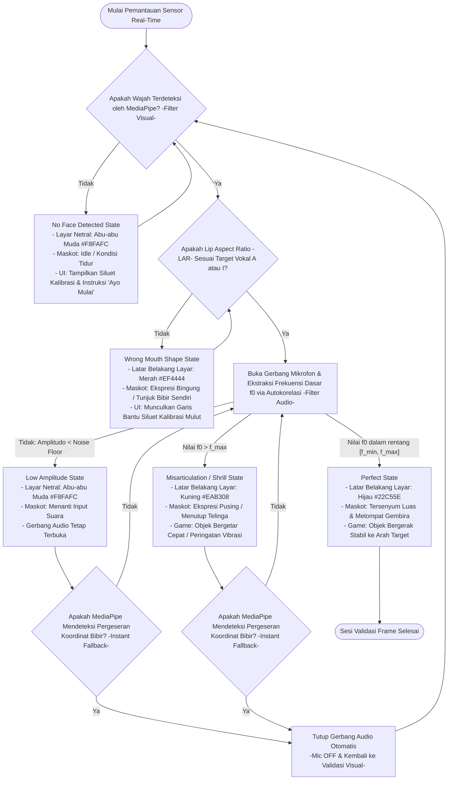

# Spesifikasi Matriks Visual Feedback: Real-Time Performance Calibration

Dokumen ini mendefinisikan pemetaan antara input sensorik (kamera dan mikrofon) dengan respons visual pada layar aplikasi V-NADA. Mengingat aplikasi ini menggunakan paradigma Substitusi Sensorik, seluruh umpan balik auditif yang hilang harus digantikan oleh isyarat visual yang instan dan kontras tinggi untuk memfasilitasi latihan mandiri siswa tunarungu jenjang SDLB-B.

**Kode Dokumen:** GAME-03
**Versi:** 2

---

## 1. Matriks Kondisi Visual (State Mapping Table)

Tabel di bawah ini merinci parameter kuantitatif dan logika respons visual untuk setiap kondisi input selama sesi terapi artikulasi.

| Kondisi (State) | Parameter Input (LAR & f0) | Respons Visual Utama | Logika Game & Animasi |
|---|---|---|---|
| **Perfect State** | LAR ≈ Target AND f0 ∈ [f_min, f_max] | Latar belakang layar: #22C55E (Hijau) | Maskot tersenyum luas; Objek game bergerak stabil ke arah target. |
| **Misarticulation (Shrill)** | LAR ≈ Target AND f0 > f_max | Latar belakang layar: #EAB308 (Kuning) | Maskot menunjukkan ekspresi pusing; Objek game bergetar cepat (vibrasi) untuk peringatan. |
| **Wrong Mouth Shape** | LAR ≠ Target | Latar belakang layar: #EF4444 (Merah) | Muncul siluet bantuan bentuk mulut; Maskot menunjukkan ekspresi bingung. |
| **No Face Detected** | Wajah tidak terdeteksi oleh MediaPipe (pra-mikrofon) | Layar Netral: #F8FAFC (Abu-abu Muda) | Maskot dalam kondisi 'Idle/Tidur'; Instruksi "Ayo Mulai" muncul di layar. |
| **Low Amplitude (Vacuum)** | Suara < Ambient Noise (setelah gerbang audio terbuka) | Layar Netral: #F8FAFC (Abu-abu Muda) | Maskot menanti input suara; Gerbang audio tetap terbuka. |

---

## 2. Standarisasi Spesifikasi Warna Kontras (Binary Feedback)

Untuk mendukung aksesibilitas anak tunarungu fase A & B (usia 7-9 tahun), spesifikasi warna berikut digunakan sebagai isyarat biner utama:

- **Success Green (#22C55E):** Digunakan secara instan pada seluruh layar saat Sequential Validation terpenuhi (bentuk bibir dan nada benar).
- **Warning Yellow (#EAB308):** Digunakan saat terjadi hypernasal atau frekuensi melengking ekstrem agar anak menurunkan ketegangan pita suara.
- **Error Red (#EF4444):** Digunakan sebagai penanda kesalahan motorik wajah yang signifikan (misalnya, mulut tertutup saat harus melafalkan vokal "A").

---

## 3. Panduan Desain Animasi Performa Dinamis

Umpan balik visual tidak terbatas pada perubahan warna, tetapi juga melalui perubahan elemen grafis pendukung sebagai berikut:

1. **Mouth Silhouette Calibration:** Munculkan garis bantu siluet mulut transparan (Opacity 30%) di atas preview kamera untuk membantu anak menyejajarkan posisi wajah secara mandiri.
2. **Mascot Expressions:**
   - Benar: Animasi melompat gembira dengan bintang-bintang kecil.
   - Suara Melengking: Telinga maskot bergerak-gerak tidak nyaman atau maskot menutup telinga.
   - Bentuk Bibir Salah: Maskot menunjuk ke arah bibirnya sendiri sebagai isyarat koreksi.
3. **Dynamic Obstacles:** Dalam Modul Dual-Sense, ukuran rintangan akan mengecil secara proporsional seiring dengan nilai LAR yang mendekati ambang batas target, memberikan indikasi kemajuan sebelum validasi akhir dilakukan.

---

## 4. Catatan Konteks Modular

State **No Face Detected** hanya relevan untuk Modul 2 (Dual-Sense) yang menggunakan kamera. Pada Modul 1 (VocaTone), state awal adalah **Low Amplitude (Vacuum)** karena pipeline murni audio tanpa validasi visual.

---

## 5. Logika Penanganan Suara Melengking (Hypernasal Logic)

V-NADA secara khusus mengakomodasi defisit kontrol pita suara melalui Sequential Filter:

- Jika sistem mendeteksi Lip Aspect Ratio (LAR) vokal "A" sudah benar, namun frekuensi dasar (f0) berada di atas ambang batas anak normal (di luar rentang [f_min, f_max] dari profil pengguna), sistem tidak akan memberikan skor sempurna.
- Layar akan berubah menjadi Kuning untuk memberi tahu anak bahwa posisi mulutnya sudah benar, namun cara meniupkan suaranya masih terlalu tegang (melengking).

---

## 6. Instruksi Visualisasi (Pedoman Produksi Asset)

Mengingat keterbatasan dalam pembuatan diagram secara langsung, berikut adalah panduan bagi UI/UX Designer untuk merealisasikan matriks ini:

### 6.1. Flowchart Validasi

- **Mockup UI:** Rancang tiga state layar utama (Hijau, Merah, Kuning) dengan tetap menjaga visibilitas siluet mulut di area tengah bawah layar.
- **Mascot Sprite Sheet:** Siapkan setidaknya 4 ekspresi dasar (Netral, Senang, Bingung, Pusing) untuk merepresentasikan kondisi dalam matriks visual di atas.