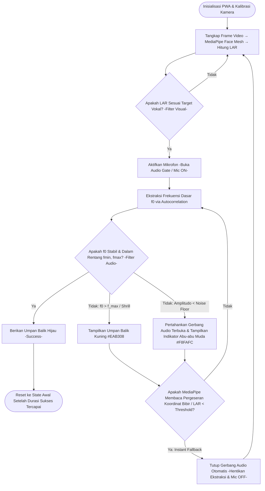
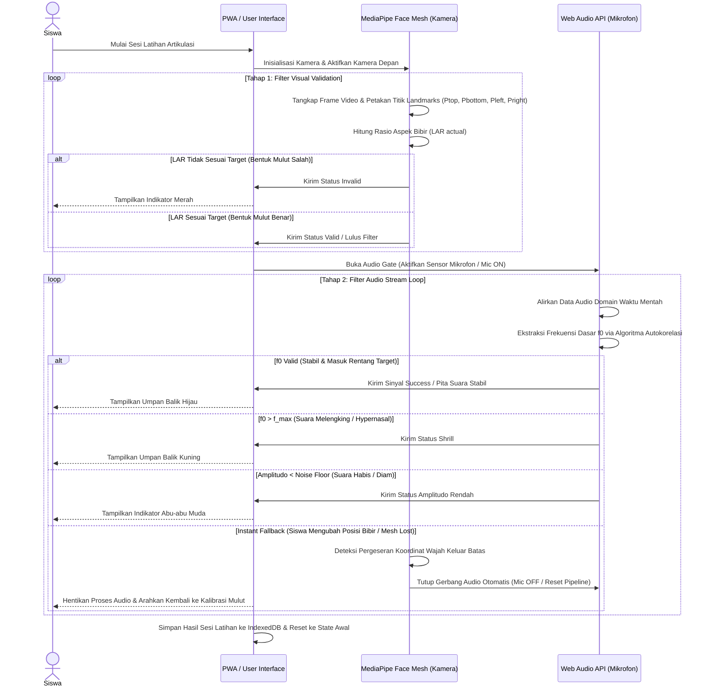

# Alur Logika Validasi Sekuensial untuk Penginderaan Multimodal

**Kode Dokumen:** TECH-01
**Versi:** 3

Dokumen ini merinci spesifikasi teknis untuk komponen pertama dalam fase Desain Arsitektur Sistem & Logika Teknologi V-NADA (Visual Networked Audio & Digital Articulation). Fokus utama adalah pembuatan *Sequential Validation Logic Flow* yang mengoordinasikan sensor kamera depan dan mikrofon secara efisien untuk membantu siswa tunarungu dalam melatih fonasi dan artikulasi.

---

## 1. Deskripsi Umum

Komponen ini dirancang untuk menciptakan data pipeline yang sinkron, di mana sistem harus melakukan pengecekan visual pada struktur motorik wajah melalui pustaka computer vision sebelum mengizinkan sensor audio menangkap sinyal wicara. Hal ini memastikan bahwa input suara hanya diproses jika posisi mulut siswa sudah sesuai dengan target fonetik yang ditentukan.

---

## 2. Pemetaan Koordinat Wajah (Tahap 1 - Filter Visual)

Logika penangkapan bingkai video (video frame) menggunakan **MediaPipe Face Mesh** untuk memetakan koordinat titik-titik penting (landmarks) pada bibir secara real-time.

### 2.1 Indeks Titik Koordinat

Sistem akan memantau indeks spesifik berikut berdasarkan landmark MediaPipe Face Mesh:

| Nama Titik | Indeks FaceMesh | Deskripsi |
|---|---|---|
| **P_top** | 13 | Titik tengah bibir atas (upper lip) |
| **P_bottom** | 14 | Titik tengah bibir bawah (lower lip) |
| **P_left** | 78 | Sudut kiri bibir (left mouth corner) |
| **P_right** | 308 | Sudut kanan bibir (right mouth corner) |

### 2.2 Rumus Matematika Integrasi

Untuk mengukur bukaan mulut secara objektif, sistem menggunakan rumus jarak Euclidean:

```
d(p, q) = √((px − qx)² + (py − qy)²)
```

Nilai **Lip Aspect Ratio (LAR)** dihitung dengan perbandingan jarak vertikal dan horizontal:

```
LAR = d(P_top, P_bottom) / d(P_left, P_right)
```

**Kondisi Transisi:** Sistem membandingkan LAR_actual dengan ambang batas yang sesuai target vokal:
- Vokal **A** (mulut menganga lebar): Jika `LAR_actual ≥ lar_threshold.high` → buka gerbang audio (*Audio Gate Open*).
- Vokal **I** (bibir melebar horizontal): Jika `LAR_actual ≤ lar_threshold.low` → buka gerbang audio (*Audio Gate Open*).

---

## 3. Gerbang Pemrosesan Audio (Tahap 2 - Filter Audio)

Hanya jika Tahap 1 dinyatakan valid, sistem akan membuka saluran aliran audio (audio stream loop) dari sensor mikrofon menggunakan **Web Audio API**.

- **Pipa Data:** Data audio domain waktu mentah diteruskan ke fungsi ekstraksi frekuensi menggunakan algoritma autokorelasi.
- **Kondisi Validasi:** Frekuensi dasar (f0) dari pita suara harus berada dalam rentang target `[f_min, f_max]`.
- **Output Akhir:** Jika frekuensi stabil dan masuk dalam rentang, status akhir dinyatakan sebagai *Valid/Success*, memicu umpan balik visual positif pada antarmuka.

---

## 4. Logika Pemulihan Status (Reset & Debounce Logic)

Untuk menjaga stabilitas sistem dari fluktuasi minor, ditetapkan aturan pembatalan sekuensial:

1. **Pembatalan Instan (Instant Fallback):** Jika selama pemrosesan audio nilai LAR aktual turun di bawah ambang batas (siswa mengubah posisi mulut), sensor mikrofon akan segera ditutup otomatis.
2. **Toleransi Waktu (Debounce/Throttle Delay):** Parameter waktu ditetapkan untuk mencegah transisi status yang terlalu cepat akibat pergeseran bingkai kamera yang tidak signifikan atau noise sensor.

---

## 5. Matriks Penanganan Kegagalan (Exception Handling)

| Skenario Kegagalan | Tindakan Sistem | Status Pemulihan |
|---|---|---|
| Wajah tidak terdeteksi | Tutup gerbang audio; tampilkan panduan siluet | Visual Validation |
| LAR di bawah ambang batas | Hentikan ekstraksi frekuensi; indikator merah | Visual Validation |
| Amplitudo audio < noise floor | Pertahankan gerbang audio terbuka; tampilkan indikator Abu-abu Muda (#F8FAFC) pada layar gawai | Audio Gate Open |
| Koneksi sensor terputus | Reset seluruh pipeline; tampilkan peringatan sistem | Initial State |

---

## 6. Panduan Instruksional Pembuatan Diagram

Karena keterbatasan dalam pembuatan gambar secara langsung, berikut adalah instruksi untuk merealisasikan Technical Flowchart atau State Machine Blueprint berdasarkan logika di atas:

### A. Komponen Visual Flowchart (Mermaid.js / Miro)



### B. Visualisasi Urutan Eksekusi (Sequence Diagram)

Aktor/partisipan: **Siswa**, **PWA / User Interface**, **MediaPipe Face Mesh (Kamera)**, **Web Audio API (Mikrofon)**

