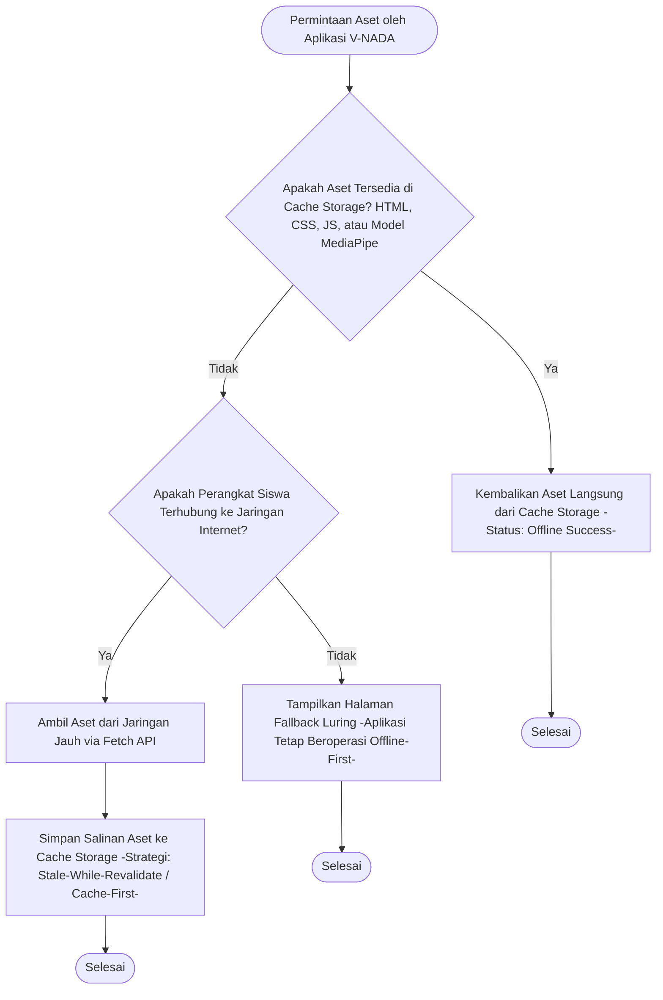
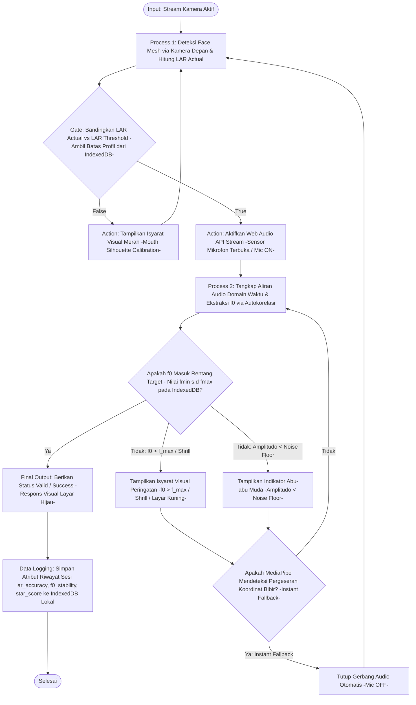

# Cetak Biru Arsitektur Data & Logika Offline-First V-NADA

**Kode Dokumen:** TECH-02
**Versi:** 2

Dokumen ini merinci spesifikasi arsitektur teknis untuk komponen V-NADA (Visual Networked Audio & Digital Articulation), sebuah inovasi teknologi digital pendidikan yang dirancang khusus untuk siswa tunarungu jenjang SDLB-B. Fokus utama dokumen ini adalah desain sistem penyimpanan data lokal dan strategi kapabilitas mandiri yang memungkinkan aplikasi beroperasi sepenuhnya secara luring (offline-first) dengan ketergantungan server cloud nol (zero-cloud server dependency).

---

## 1. Strategi Penembolokan Aset (Service Worker)

Aplikasi V-NADA dibangun berbasis Progressive Web Apps (PWA) untuk menjamin aksesibilitas ekonomi bagi pengguna dengan perangkat berspesifikasi rendah.

### 1.1 Konfigurasi Siklus Hidup Service Worker

Sistem akan mengimplementasikan skrip Service Worker untuk mengelola prapemuatan aset inti selama fase instalasi:

- **Install State:** Melakukan pre-caching terhadap file HTML, CSS, JavaScript, serta file manifes PWA.
- **Activate State:** Membersihkan cache versi lama untuk memastikan integritas data aplikasi.
- **Fetch Interception:** Menggunakan strategi Cache-First untuk aset statis dan Stale-While-Revalidate untuk komponen antarmuka permainan yang dinamis.

### 1.2 Penyimpanan Model AI (MediaPipe)

Berkas bobot model AI dari pustaka MediaPipe Face Mesh akan disimpan secara lokal di dalam Cache Storage API. Hal ini bertujuan agar proses deteksi wajah dapat berjalan instan tanpa perlu mengunduh ulang data setiap kali sesi latihan dimulai, mendukung efisiensi kuota internet pengguna.

---

## 2. Skema Basis Data Lokal (IndexedDB)

Untuk menyimpan data operasional sistem tanpa server eksternal, V-NADA menggunakan IndexedDB sebagai basis data non-relasional di sisi klien.

### 2.1 Spesifikasi Tabel Profil Pengguna

Tabel ini menyimpan parameter kalibrasi yang unik bagi setiap individu siswa.

| Atribut Data | Tipe Data | Deskripsi |
|---|---|---|
| user_id | String (PK) | Identitas unik pengguna |
| lar_threshold | Object | Nilai ambang batas LAR untuk vokal A dan I. **CATATAN:** Saat sudah lolos final baru mencakup U, E, dan O. |
| f_min | Number | Batas frekuensi bawah pita suara anak |
| f_max | Number | Batas frekuensi atas pita suara anak |

### 2.2 Spesifikasi Tabel Log Sesi Latihan

Tabel ini merekam riwayat progres terapi siswa untuk keperluan evaluasi pedagogis.

| Atribut Data | Tipe Data | Deskripsi |
|---|---|---|
| session_id | String (PK) | ID unik setiap sesi latihan |
| timestamp | Date | Waktu pelaksanaan latihan |
| module_type | Enum | Modul 1 (VocaTone) atau Modul 2 (Dual-Sense) |
| lar_accuracy | Float | Nilai akumulasi kepresisian bukaan bibir. **Catatan:** Hanya relevan untuk Modul 2 (Dual-Sense). Pada Modul 1 (VocaTone), field ini bernilai 0 karena pipeline murni audio. |
| f0_stability | Float | Nilai kestabilan nada yang dihasilkan |
| star_score | Integer | Perolehan reward dalam sistem gamifikasi (skala 1-3) |

---

## 3. Arsitektur Logika Penilaian (Sequential Validation)

V-NADA mengadopsi Sequential Validation Engine untuk memastikan akurasi artikulasi yang objektif.

### 3.1 Alur Pemrosesan Multimodal

Proses validasi dilakukan secara berurutan dalam dua tahap utama:

1. **Stage 1 - Visual Filter:** Sistem menggunakan kamera depan untuk mendeteksi koordinat landmarks bibir dan menghitung nilai Lip Aspect Ratio (LAR).
2. **Stage 2 - Audio Filter:** Jika dan hanya jika Stage 1 valid, sistem membuka sensor mikrofon untuk memproses frekuensi dasar (f0) melalui algoritma autokorelasi.

### 3.2 Implementasi Matematis

Pencarian jarak antara titik koordinat bibir menggunakan rumus Euclidean:

```
d(p, q) = √((px − qx)² + (py − qy)²)
```

Nilai LAR didefinisikan sebagai rasio jarak vertikal (P_top, P_bottom) terhadap jarak horizontal (P_left, P_right):

```
LAR = d(P_top, P_bottom) / d(P_left, P_right)
```

---

## 4. Panduan Visualisasi Diagram (Instruksi Teknis)

Sesuai dengan kriteria penerimaan, berikut adalah panduan instruksional untuk merealisasikan diagram teknis dalam platform desain (seperti Figma atau Mermaid.js):

### 4.1 Flowchart Intersepsi Permintaan Jaringan



### 4.2 Diagram Alur Sequential Validation



---

## 5. Mekanisme Isolasi Komputasi & Privasi

Seluruh pipa data (data pipeline) dirancang untuk berjalan 100% pada memori lokal gawai pengguna. Tidak ada transmisi data video atau audio ke server luar, sehingga menjamin privasi data sensitif anak berkebutuhan khusus sesuai standar keamanan data medis dan pendidikan.