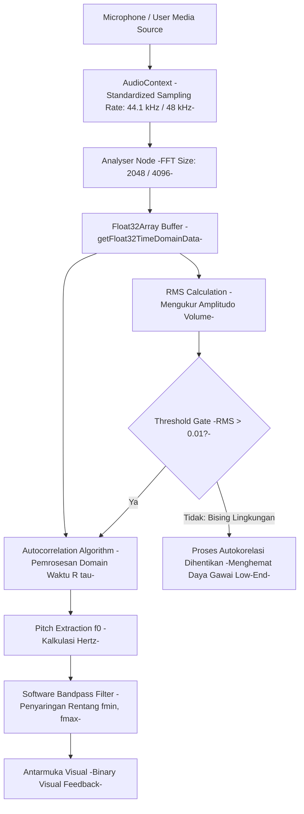

# Cetak Biru Pemrosesan Sinyal Audio (Audio Signal Processing Blueprint)

*Dokumen ini merinci spesifikasi teknis untuk komponen pemrosesan sinyal audio pada inovasi V-NADA (Visual Networked Audio & Digital Articulation). Tujuan utamanya adalah mengekstrak frekuensi dasar (f0) pita suara pengguna secara real-time untuk memberikan umpan balik visual yang objektif bagi siswa tunarungu. Arsitektur ini dirancang untuk berjalan pada sisi klien (client-side) guna memastikan efisiensi biaya dan aksesibilitas offline pada gawai dengan spesifikasi rendah.*

**Kode Dokumen:** TECH-03
**Versi:** 2

---

## 1. Ingesti Aliran Audio (Audio Stream Ingestion)

Proses dimulai dengan menangkap sinyal audio analog dari mikrofon perangkat.

- **Mekanisme Izin:** Menggunakan fungsi `navigator.mediaDevices.getUserMedia({ audio: true, video: false })` untuk meminta akses sensor mikrofon secara aman.
- **Inisialisasi AudioContext:** Membuat objek `AudioContext` sebagai lingkungan pemrosesan utama dan menginisialisasi `MediaStreamAudioSourceNode` untuk mengalirkan data audio dari stream mikrofon.
- **Standardisasi Laju Sampel:** Sistem harus melakukan normalisasi terhadap variasi *sampling rate* perangkat bawaan ke nilai standar 44.1 kHz atau 48 kHz guna menjaga konsistensi kalkulasi algoritma.

---

## 2. Konfigurasi Node Analisis (AnalyserNode Setup)

Untuk memproses sinyal, aliran audio diarahkan melalui serangkaian node dalam grafik audio.

- **Interkoneksi Node:** Aliran audio dihubungkan dari `Source Node` ke `AnalyserNode` sebelum akhirnya diteruskan ke `Destination` (biasanya dalam mode senyap untuk menghindari *feedback loop*).
- **Parameter FFT:** Ukuran *Fast Fourier Transform* ditetapkan pada `fftSize = 2048` atau `4096`. Pemilihan ini bertujuan untuk menyeimbangkan antara resolusi frekuensi rendah (penting untuk deteksi pitch) dan latensi pemrosesan.
- **Alokasi Buffer:** Data domain waktu diekstraksi ke dalam buffer `Float32Array` secara berkala menggunakan fungsi `getFloat32TimeDomainData()`.

---

## 3. Logika Pitch Detection (Autocorrelation)

Inti dari modul ini adalah ekstraksi frekuensi dasar (f0) menggunakan algoritma autokorelasi.

- **Struktur Matematika:** Algoritma menghitung tingkat kemiripan sinyal dengan dirinya sendiri pada variasi jeda waktu (τ) menggunakan rumus:

  ```
  R(τ) = Σ (t=0 to N−1) x(t) · x(t + τ)
  ```

- **Rentang Pencarian:** Autokorelasi dihitung hanya untuk jeda waktu (τ) yang bersesuaian dengan rentang frekuensi 50–800 Hz, mencakup spektrum suara anak usia 7–9 tahun.
- **Peak-Picking:** Sistem akan mencari puncak periodisitas tertinggi dalam hasil autokorelasi untuk mengidentifikasi periode sinyal.
- **Konversi Frekuensi:** Nilai jeda waktu (τ) yang ditemukan kemudian dikonversi menjadi satuan Hertz dengan rumus:

  ```
  f0 = Sampling Rate / τ
  ```

---

## 4. Noise Gating & Pemfilteran Sinyal

Guna memastikan data yang diolah adalah suara manusia yang valid dan bukan bising lingkungan:

- **Root Mean Square (RMS):** Sistem menghitung nilai RMS dari buffer input untuk mengukur amplitudo volume.
- **Noise Floor Gate:** Jika nilai RMS berada di bawah ambang batas (misalnya < 0.01), maka proses autokorelasi tidak akan dijalankan untuk menghemat daya komputasi dan menghindari data sampah.
- **Software Bandpass Filter:** Hasil ekstraksi frekuensi yang berada di luar rentang spektrum suara manusia target ([f_min, f_max]) akan diabaikan oleh sistem.

---

## 5. Panduan Implementasi Diagram Blok



---

## 6. Atribut Konfigurasi Teknis

| Parameter | Spesifikasi |
|---|---|
| API Utama | Web Audio API |
| FFT Size | 2048 / 4096 |
| Ambang Batas RMS | 0.01 (atau sesuai kalibrasi lingkungan) |
| Metode Deteksi | Time-Domain Autocorrelation |
| Buffer Data | Float32Array |
| Target Hardware | Perangkat Low-End (Android/Laptop) |