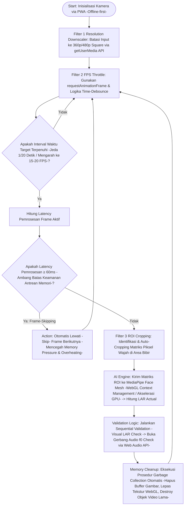

# Camera Frame Optimization Map for Low-End Device Performance

Untuk menjaga performa pelacakan koordinat wajah (Face Mesh) tetap responsif dan bebas dari stuttering, dokumen ini menetapkan strategi optimasi pipeline pemrosesan gambar di sisi klien (client-side). Fokus utama adalah meminimalkan beban komputasi (low computational overhead) tanpa mengorbankan akurasi deteksi Lip Aspect Ratio (LAR) yang krusial bagi modul Dual-Sense.

**Kode Dokumen:** TECH-04
**Versi:** 2

---

## 1. Strategi Downscaling Resolusi Input

Untuk menyeimbangkan akurasi deteksi landmark wajah dan kecepatan pemrosesan, sistem tidak akan menggunakan resolusi mentah (raw) dari kamera (720p/1080p).

- **Konfigurasi MediaStreamConstraints:** Resolusi dibatasi pada tingkat perangkat lunak melalui API `getUserMedia`.
- **Standar Resolusi Optimal:** Maksimal resolusi ditetapkan pada Square 360p (360x360 px) atau 480p.
- **Region of Interest (ROI) & Auto-Cropping:**
  - Sistem akan mengidentifikasi area wajah secara kasar pada frame awal.
  - Mekanisme auto-cropping diterapkan untuk mengisolasi area di sekitar bibir (koordinat target untuk LAR).
  - Hanya matriks piksel di area ROI yang akan dikirim ke pustaka MediaPipe Face Mesh.

---

## 2. Logika FPS Throttling Engine

V-NADA akan membatasi jumlah frame yang diproses per detik untuk mencegah overheating dan penggunaan memori berlebih pada perangkat dengan spesifikasi rendah.

- **Mekanisme Kontrol:** Menggunakan fungsi `requestAnimationFrame()` yang dikombinasikan dengan logika time-debounce.
- **Target Frame Rate:** Pengiriman frame ke model AI dibatasi pada rentang 15 hingga 20 FPS, meskipun kamera asli mendukung 30/60 FPS.
- **Algoritma Frame-Skipping:**
  - Sistem akan menghitung latensi pemrosesan setiap frame.
   - Jika latensi terdeteksi meningkat melampaui ambang batas keamanan (≥60ms), sistem akan secara otomatis melewati (skip) frame berikutnya untuk mencegah penumpukan antrean memori (memory pressure).

---

## 3. Optimasi Memori dan Pengolahan Grafis

Seluruh proses komputasi terjadi di perangkat lokal gawai siswa tanpa membutuhkan server cloud berbayar.

- **WebGL Context Management:** Memanfaatkan akselerasi perangkat keras (hardware acceleration) berbasis WebGL untuk pemrosesan koordinat wajah secara paralel di GPU.
- **Garbage Collection (Pembersihan Memori):**
  - Prosedur otomatis untuk menghapus buffer gambar yang sudah tidak digunakan.
  - Pelepasan tekstur WebGL secara berkala setelah frame selesai diproses.
  - Penghancuran (destroy) objek video frame lama untuk mencegah kebocoran memori (memory leaks).

---

## 4. Parameter Kuantitatif Optimasi

| Parameter | Spesifikasi Target | Keterangan |
|---|---|---|
| Resolusi Maksimum | 360p / 480p (Square) | Mengurangi beban piksel per frame. |
| Target FPS | 15 - 20 FPS | Menjaga suhu perangkat & stabilitas CPU. |
| Pipeline Latency | < 60ms | Memastikan umpan balik visual real-time. |
| Memory Limit | < 150 MB | Alokasi untuk proses Computer Vision. |

---

## 5. Image Pipeline Flowchart

