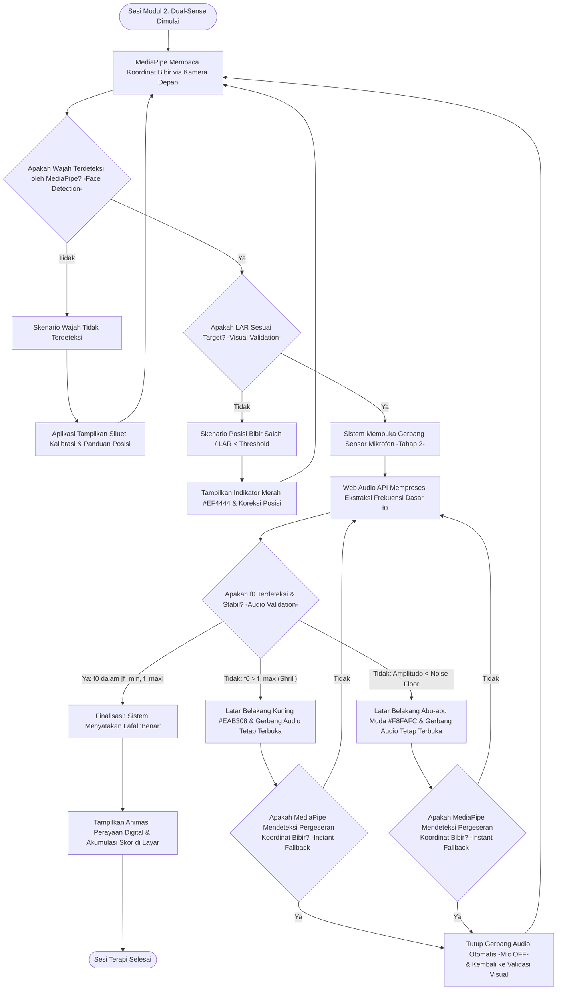

# UX-03: Pemetaan Alur Pengguna (User Journey Mapping) - V-NADA

Dokumen ini merinci spesifikasi User Journey Mapping untuk aplikasi V-NADA (Visual Networked Audio & Digital Articulation). Fokus utama dari pemetaan ini adalah menciptakan pengalaman pengguna yang mulus bagi siswa tunarungu usia 7-9 tahun (Fase A & B) dengan prinsip Sensory Substitution. Karena target pengguna mengalami hambatan pendengaran berat hingga total, seluruh interaksi dirancang tanpa ketergantungan pada instruksi suara (zero-audio feedback).

**Kode Dokumen:** UX-03
**Versi:** 2

---

## 1. Strategi Substitusi Sensorik dalam UX

Seluruh titik sentuh (touchpoints) dalam aplikasi menggunakan isyarat visual kontras tinggi untuk menggantikan umpan balik auditif:

- **Warna Hijau:** Menandakan keberhasilan/validasi (lafal benar).
- **Warna Kuning/Merah:** Menandakan koreksi (posisi bibir salah atau suara belum terdeteksi).
- **Isyarat Visual Dinamis:** Penggunaan animasi dan ikonografi intuitif untuk memandu anak tanpa teks yang rumit.

---

## 2. Pemetaan Alur Pengguna Utama (Student's Happy Path)

Alur ini memetakan perjalanan ideal siswa dari pembukaan aplikasi hingga penerimaan reward.

| Tahapan | Tindakan Pengguna | Respon Sistem (Visual) |
|---|---|---|
| **Onboarding** | Membuka PWA V-NADA di gawai. | Menampilkan layar *splash* dengan maskot animasi yang menyapa secara visual. |
| **Beranda / Seleksi Modul** | Memilih Modul 1 (VocaTone) atau Modul 2 (Dual-Sense). | Ikon visual besar (Balon Udara untuk VocaTone, Huruf Vokal untuk Dual-Sense) bergetar saat disentuh. |
| **VocaTone (Modul 1)** | Langsung masuk ke sesi fonasi — hanya menggunakan mikrofon (tanpa kamera). | Canvas balon udara aktif; latar belakang abu-abu menunggu input suara. |
| **Kalibrasi Wajah (Pra-Modul 2)** | *Khusus Dual-Sense:* Mengarahkan wajah ke kamera depan. | Menampilkan *Mouth Silhouette Calibration* (siluet garis bantu mulut) pada layar. |
| **Validasi Posisi (Pra-Modul 2)** | *Khusus Dual-Sense:* Menyejajarkan mulut dengan siluet. | Bingkai kamera berubah **Hijau** saat wajah terdeteksi MediaPipe Face Mesh. |
| **Interaksi Gameplay** | Melafalkan vokal (misal: "A"). | **VocaTone:** Canvas balon bergerak berdasarkan f0. **Dual-Sense:** Validasi LAR → buka mik → f0 → reward. |
| **Reward** | Berhasil menyelesaikan target terapi. | Animasi perayaan digital dan akumulasi skor di layar. |

---

## 3. Logika Validasi Sekuensial (Modul 2: Dual-Sense)

Dalam Modul 2, alur validasi mengikuti struktur *Sequential Validation Logic*:

1. **Tahap 1 (Visual):** Sistem membaca koordinat bibir via MediaPipe. Jika Lip Aspect Ratio (LAR) sesuai dengan target vokal (misal: "A" menganga lebar), maka sistem lanjut ke tahap berikutnya.
2. **Tahap 2 (Audio):** Hanya jika LAR valid, sistem membuka gerbang sensor mikrofon untuk memproses frekuensi dasar f₀.
3. **Finalisasi:** Jika kedua kondisi terpenuhi secara berurutan, sistem memberikan umpan balik "Benar".

---

## 4. Pemetaan Penanganan Masalah (Error/Alternative Path)

Skenario mitigasi saat terjadi hambatan teknis atau kegagalan interaksi:

- **Izin Sensor Ditolak:** Jika akses kamera/mikrofon ditolak, sistem menampilkan ilustrasi besar yang mengarahkan pengguna (atau pendamping) ke pengaturan izin di peramban.
- **Wajah Keluar Area:** Jika MediaPipe kehilangan deteksi wajah di tengah sesi, permainan secara otomatis masuk ke mode pause dan menampilkan siluet kalibrasi ulang hingga wajah terdeteksi kembali.
- **Suara Melengking (Shrill):** Jika f0 > f_max (terlalu tinggi), layar berubah menjadi Kuning (#EAB308) sebagai isyarat untuk menurunkan ketegangan pita suara; gerbang audio tetap terbuka.
- **Kehabisan Napas/Diam (Low Amplitude):** Jika amplitudo < Noise Floor (RMS < 0.01), elemen game (seperti balon udara) meluncur turun secara perlahan dengan perubahan warna layar menjadi Abu-abu Muda (#F8FAFC); gerbang audio tetap terbuka.

---

## 5. Pemetaan Alur Pengguna Sekunder (Teacher/Parent Path)

Peran pendamping sangat krusial dalam keberhasilan terapi mandiri:

- **Pendampingan Kalibrasi:** Orang tua membantu memastikan pencahayaan ruangan cukup agar MediaPipe dapat memetakan landmarks wajah dengan akurat.
- **Pemantauan Progres:** Setelah sesi berakhir, pendamping dapat mengakses layar ringkasan kinerja yang menampilkan grafik sederhana mengenai kestabilan pita suara (f₀) dan presisi bukaan bibir anak (LAR).

---

## 6. Panduan Instruksional untuk Realisasi Diagram Visual

Karena keterbatasan kemampuan teknis untuk membuat gambar secara langsung, berikut adalah panduan instruksional bagi tim desain untuk mewujudkan diagram User Journey Mapping di Figma, Miro, atau Whimsical:

### 6.1. Struktur Papan (Board Structure)

1. **Lajur Horizontal (Swimlanes):** Buat tiga lajur utama berlabel "Siswa (Primary)", "Sistem (V-NADA)", dan "Pendamping (Secondary)".
2. **Lajur Fase:** Bagi secara vertikal menjadi fase: "Initial Setup", "Calibration", "Activity/Gameplay", dan "Result/Feedback".
3. **Elemen Visual Cues:** Gunakan kode warna pada setiap kotak proses:
   - Biru Muda: Tindakan pengguna.
   - Hijau: Respon sukses sistem.
   - Kuning/Merah: Alur error/koreksi.

### 6.2. Detail Visualisasi Sequential Logic

Diagram alir logika validasi sekuensial Modul 2 (Dual-Sense):

**Alur singkat diagram di atas:**
- Jika wajah **tidak** terdeteksi → aplikasi tampilkan siluet kalibrasi & panduan posisi → kembali ke pembacaan koordinat bibir.
- Jika wajah terdeteksi tetapi LAR **tidak** sesuai target → tampilkan indikator Merah (#EF4444) & panduan koreksi posisi → kembali ke pembacaan koordinat bibir.
- Jika LAR **sesuai** target → sistem lanjut ke validasi audio (frekuensi dasar f0).
- Jika f0 **stabil & dalam rentang** [f_min, f_max] → finalisasi "Benar" → animasi perayaan & skor → sesi terapi selesai.
- Jika f0 > f_max **(Shrill/melengking)** → layar Kuning (#EAB308) & elemen game bergetar → periksa posisi bibir via MediaPipe: jika LAR bergeser, tutup mikrofon & kembali ke validasi visual; jika tidak, mikrofon tetap terbuka.
- Jika Amplitudo < Noise Floor **(kehabisan napas/diam)** → layar Abu-abu Muda (#F8FAFC) & elemen game meluncur turun → periksa posisi bibir via MediaPipe: jika LAR bergeser, tutup mikrofon & kembali ke validasi visual; jika tidak, mikrofon tetap terbuka.