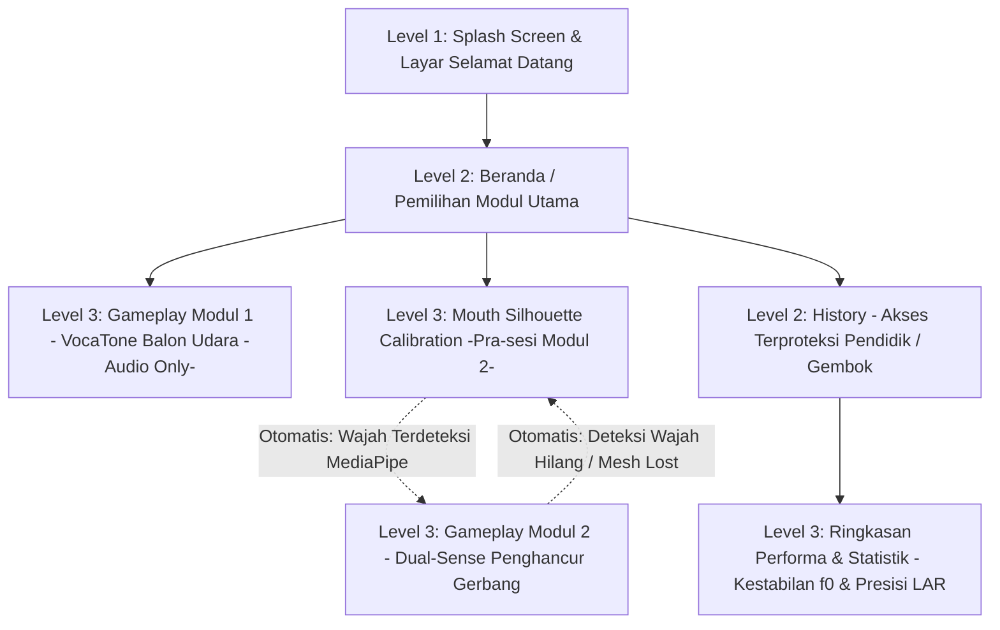

# Spesifikasi Arsitektur Informasi & Peta Navigasi V-NADA PWA

Dokumen ini merinci struktur organisasi konten dan sistem navigasi untuk aplikasi Progressive Web Apps (PWA) V-NADA. Arsitektur ini dirancang khusus dengan pendekatan Sensory Substitution untuk mendukung kemandirian operasional siswa tunarungu jenjang SDLB-B Fase A & B (usia 7-9 tahun).

**Kode Dokumen:** UX-04
**Versi:** 2

---

## 1. Hierarki Struktur Menu (Site Map)

Struktur menu V-NADA menerapkan *flat hierarchy* dengan kedalaman maksimal 3 tingkat (*3-click rule*) untuk meminimalkan beban kognitif anak. Aplikasi beroperasi dengan prinsip *offline-first* untuk memastikan aksesibilitas di daerah dengan keterbatasan sinyal.

| Level 1: Initial & Setup | Level 2: Core Hub | Level 3: Interaction & Data |
|---|---|---|
| Splash Screen | Home / Pemilihan Modul | Gameplay Modul 1: VocaTone (Balon Udara) — Audio Only |
| — | — | Mouth Silhouette Calibration (Pra-sesi Modul 2) → Gameplay Modul 2: Dual-Sense |
| — | History (Akses Guru/Orang Tua) | Ringkasan Performa & Statistik (f0 & LAR) |

---

## 2. Standar Navigasi Visual Berbasis Isyarat (Cue-Based)

Mengingat target pengguna mengalami gangguan pendengaran berat hingga total, navigasi harus bersifat 100% zero-audio.

- **Universal Navigation Icons:**
  - Tombol "Kembali" menggunakan ikon panah kiri berukuran besar (minimal 60dp) yang diletakkan konsisten di pojok kiri atas.
  - Ikon navigasi menggunakan representasi visual konkret, bukan abstrak.
- **Touch Target Standards:**
  - Seluruh elemen interaktif wajib memiliki ukuran minimal 60x60dp atau piksel setara (*fat-finger friendly*) untuk mengakomodasi kontrol motorik anak.
- **Visual Feedback Loop:**
  - Sistem menggunakan *Binary Visual Feedback*: Layar berwarna hijau untuk aksi yang benar/berhasil dan kuning/merah untuk aksi yang memerlukan perbaikan.

---

## 3. Logika Transisi Antar Halaman (Wireflow)

Transisi halaman dikelola secara otomatis berdasarkan validasi sistem dan tindakan pengguna:

1. **Akses Beranda:** Setelah layar splash, sistem langsung menampilkan halaman Beranda/Pemilihan Modul tanpa prasyarat kalibrasi kamera.
2. **VocaTone (Modul 1):** Modul 1 berjalan tanpa validasi visual — hanya menggunakan sensor mikrofon. Tidak ada prasyarat kalibrasi kamera.
3. **Kalibrasi Dual-Sense (Modul 2):** Saat pengguna memilih Modul 2 (Dual-Sense), sistem menjalankan Mouth Silhouette Calibration terlebih dahulu. Setelah wajah terdeteksi via MediaPipe Face Mesh, sistem secara otomatis masuk ke sesi gameplay.
4. **Sequential Validation Logic (Modul 2):** Transisi di dalam gameplay Dual-Sense mengikuti alur: Deteksi Visual (LAR) → Pembukaan Sensor Mikrofon → Eksekusi Aksi Game.
5. **Penanganan Error (Modul 2):** Jika sistem kehilangan deteksi wajah di tengah sesi Dual-Sense (*mesh lost*), aplikasi akan melakukan interupsi visual dan mengarahkan pengguna kembali ke halaman kalibrasi posisi mulut secara otomatis.

---

## 4. Panduan Implementasi Diagram (Instructional Guidelines)

Karena keterbatasan kemampuan teknis untuk menghasilkan gambar secara langsung, tim desain diinstruksikan untuk mengikuti panduan berikut dalam pembuatan diagram visual menggunakan Figma atau Miro:

### 4.1. Pembuatan Diagram User Journey & IA

**Catatan alur:**
- Dari Beranda, pengguna dapat memilih Modul 1 (VocaTone), Modul 2 (Dual-Sense), atau masuk ke halaman History (akses terproteksi, biasanya untuk guru/orang tua) yang mengarah ke Ringkasan Performa & Statistik.
- Modul 1 (VocaTone) tidak memerlukan kalibrasi kamera — cukup akses mikrofon.
- Saat memilih Modul 2 (Dual-Sense), sistem menjalankan Mouth Silhouette Calibration terlebih dahulu. Setelah wajah terdeteksi oleh MediaPipe, sistem otomatis masuk ke sesi gameplay Dual-Sense.
- Jika deteksi wajah hilang (mesh lost) selama sesi Dual-Sense, sistem otomatis kembali ke halaman kalibrasi.

### 4.2. Pembuatan Wireflow Dasar

- Sertakan tangkapan layar (screenshot) komponen *Mouth Silhouette Calibration* sebagai titik awal alur.
- Tunjukkan titik pemisahan (*decision point*) antara Modul 1 (VocaTone) yang hanya menggunakan mikrofon dan Modul 2 (Dual-Sense) yang menggunakan kamera + mikrofon secara sekuensial.
- Visualisasikan proteksi akses pada halaman "History" (misal: ikon gembok) untuk menandakan area khusus dewasa/pendidik.